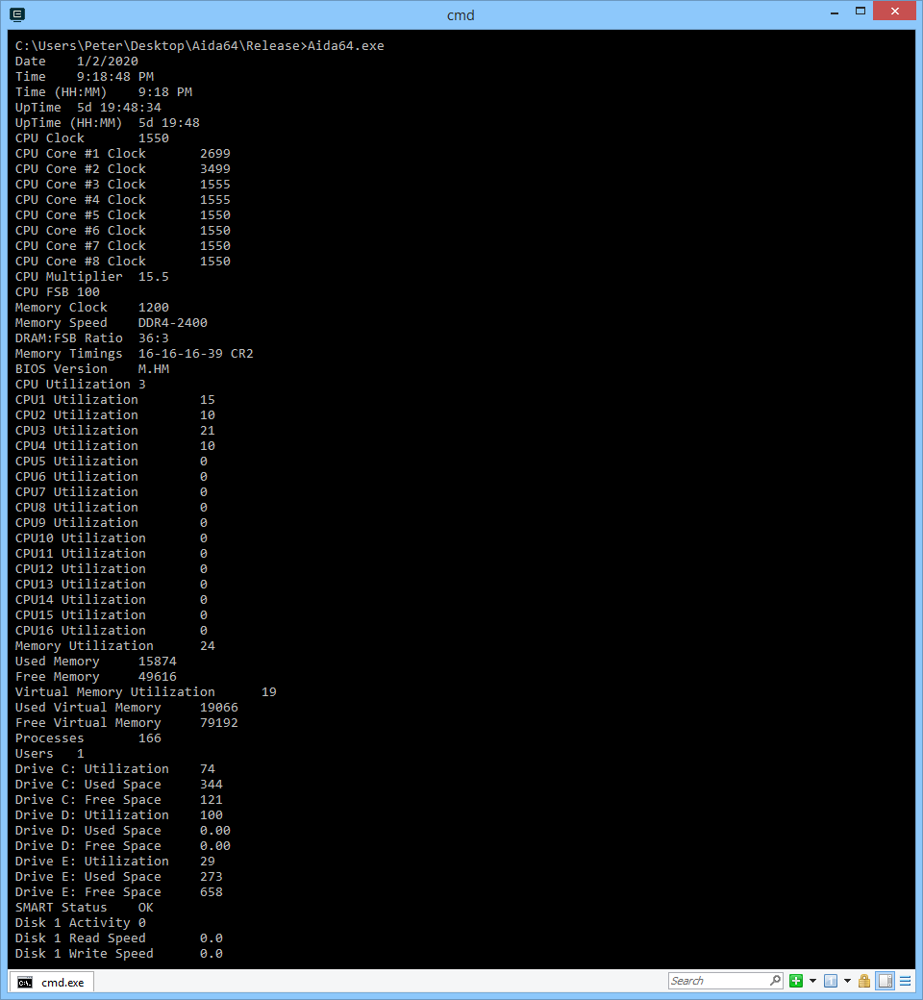
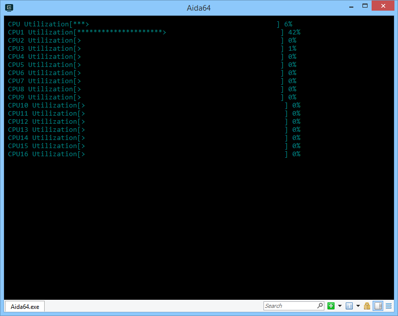

# AIDA64-CLI
 Command line monitoring tool, using AIDA64 data

 # Changelog
- Version 0:  
Pure text, using C-string functions, showing infomation line by line. The AIDA64 memory mapped file data is a long '\0' ended string. I **did not** implement parser. 

- Version 1:
Using a terminal-based progress bar library here:
[https://github.com/p-ranav/indicators](https://github.com/p-ranav/indicators) And I implemented a parser to store ``label`` and ``value`` into a ``struct``.  
The problem being that in order to achieve thread safety, the library seems to use template to draw multiple progress bar. Therefore, the number of progress bars to draw have to be determined at **compile time** instead of **run time**.
